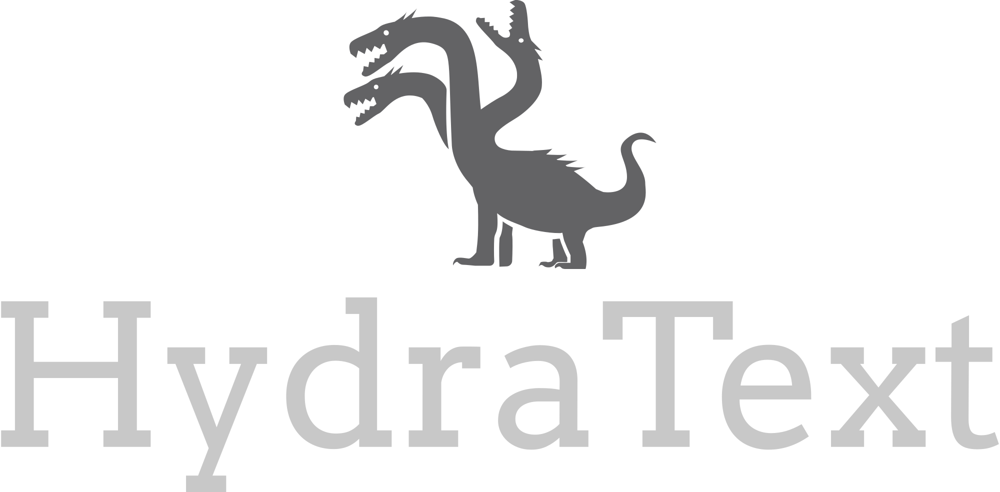
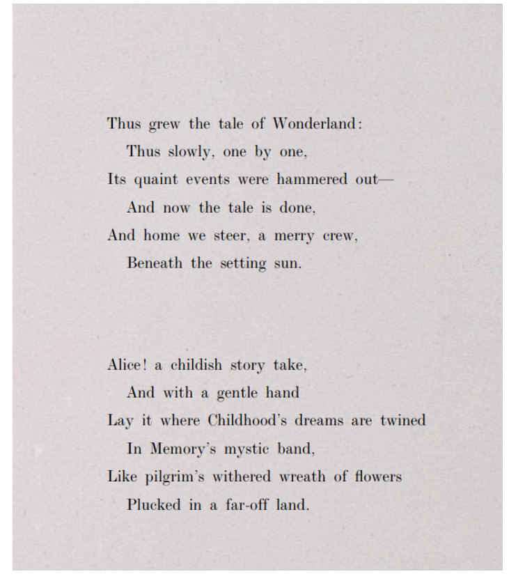
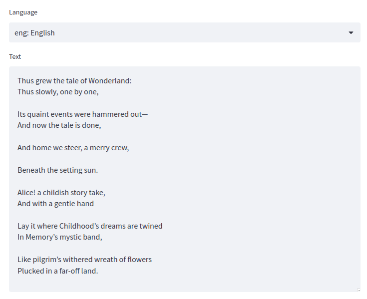
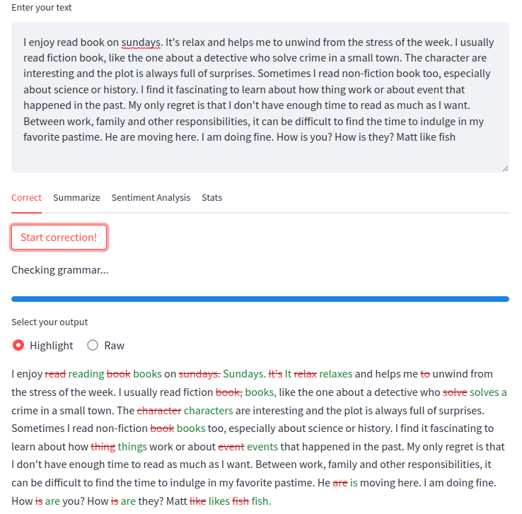
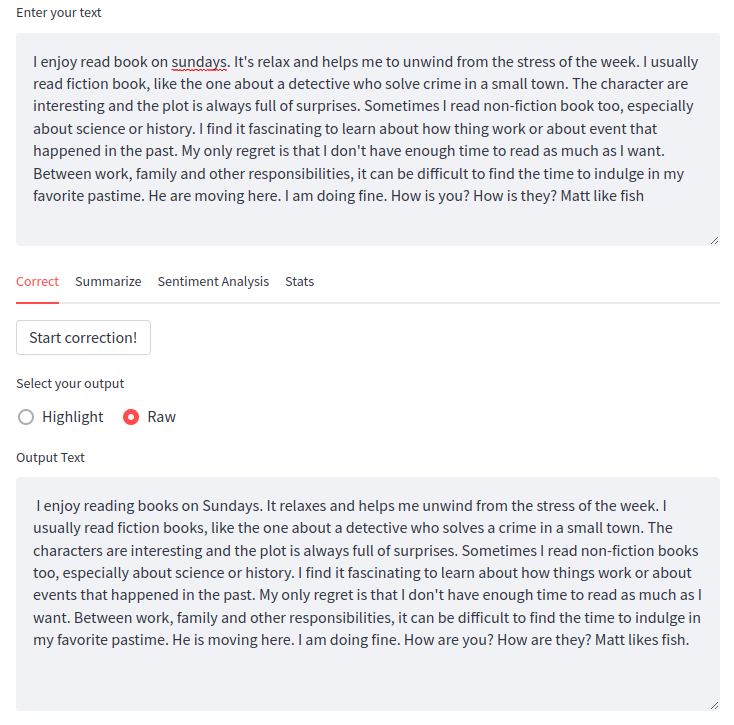
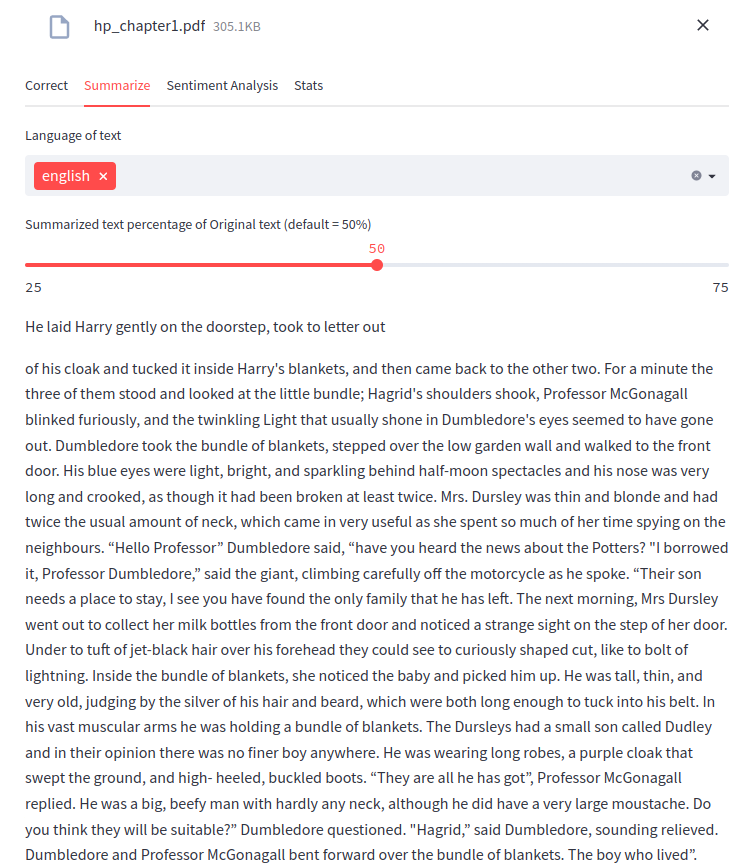
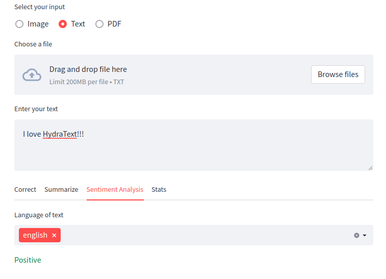

## Welcome to HydraText, 
A Natural Language Processing tool developed in the context of a Software Engineering Master's course: Scripting in Natural Language Processing. 

The present tool provides the following functionalities and is designed to be accessible for any person with or without knowledge either in Software Engineering and Natural Language Processing. 

Have fun using our tool!!! We hope it's useful!!! 😁

> **Note:** After installing the tool, the command *hydratxt_post_install* may be run.

### 📸 Extract text from images and PDFs

Provide an image of any type and the text will be extracted from it.
The default language is English, but you can also use other languages.
For that, in the image section just select the language you want to use and download it.

**Note**: This feature uses the Tesseract OCR engine. To use it, you need to download it first. See [installation instructions](https://tesseract-ocr.github.io/tessdoc/Installation.html).

You can also extract text from a PDF file. Just upload it and the text will be extracted.

### 📄 Correct grammar

Provide a text, or use the text extracted from an image or PDF, and the grammar will be corrected.
The corrected text can be seen in two ways:
- **Highlights**: The words that were removed will be highlighted in red and the words that were added will be highlighted in green.

- **Raw**: The corrected text with no highlights.

### 📄 Summarize text

Provide a text, use the text extracted from an image or PDF, or the text with the grammar corrected. The result will be a summary of the text.
The length of the summary can be changed by the user. Default value is 50% of the original text but it can be changed to 25% or 75% of it.

### 📊 Analyze text sentiment

Provide a text, or use the text extracted from an image or PDF or the text with the grammar corrected, and it will tell if the text is neutral, postive or negative in what comes to sentiment.

### 📊 Text statistics

Provide a text, or use the text extracted from an image or PDF and it will show the following statistics:

- Vocabulary size (number of unique words)
- Top 10 most used words
- Top 10 most used words without stopwords
- List of collocations (A sequence of words that occurs together unusually often.)